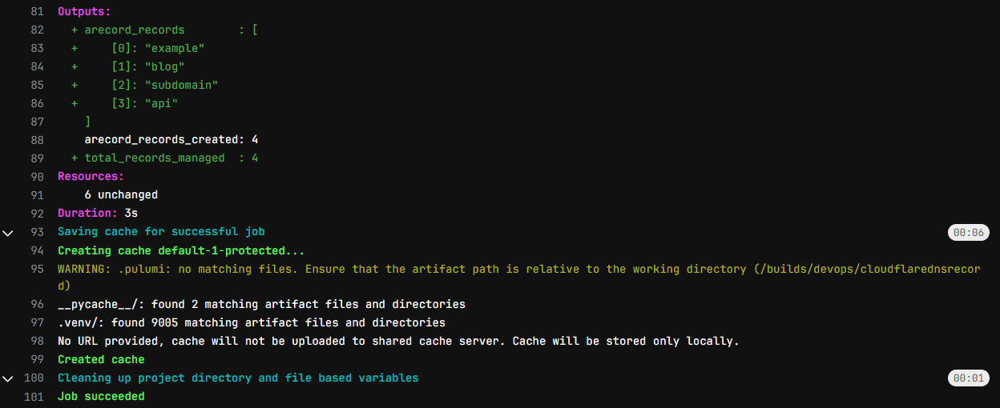

# Cloudflare DNS Record Management with Pulumi

This project automates DNS record management in Cloudflare using Pulumi's infrastructure-as-code approach. It creates A and CNAME records from YAML configuration files while handling existing records gracefully.



## Features

- 🚀 **Declarative DNS Management**: Define records in simple YAML files
- 🔄 **Idempotent Operations**: Skips existing records automatically
- ⚡ **Cloudflare Integration**: Uses Cloudflare's official Pulumi provider
- 🛡️ **Error Handling**: Robust error checking and reporting
- 🔍 **Existence Checks**: Prevents duplicate record creation
- 📊 **Output Reporting**: Shows created records count

## Prerequisites

- Python 3.7+
- Pulumi CLI
- Cloudflare account with API access
- GitLab account (for CI/CD pipeline)

## Project Structure

```
cloudflare-dns-record/
├── Pulumi.yaml          # Pulumi project configuration
├── __main__.py          # Main Pulumi program
├── requirements.txt     # Python dependencies
├── resources/
│   ├── arecord.yaml     # A record definitions
│   └── cname.yaml       # CNAME record definitions
└── README.md            # This file
```

## Setup

1. **Install dependencies**:
   ```bash
   pip install -r requirements.txt
   ```

2. **Create record files**:
   - Add your A records to `resources/arecord.yaml`
   - Add your CNAME records to `resources/cname.yaml`

## Example Record

```yaml
- name: "example.com"
  content: "192.0.2.1"
  type: "A"
  proxied: true

- name: "api.example.com"
  content: "203.0.113.1"
  type: "A"
  ttl: 600
  proxied: false
```

```yaml
- name: "www.example.com"
  content: "example.com"
  type: "CNAME"
  proxied: true

- name: "app.example.com"
  content: "external-app.com"
  type: "CNAME"
  ttl: 3600
  proxied: false
```

## Usage

### Local Execution
```bash
pulumi up --stack dev
```
snapshot.png

### GitLab CI/CD
The included `.gitlab-ci.yml` provides:
- Validation of project structure
- Dependency installation
- Preview of changes
- Deployment to Cloudflare

## Error Handling

The program handles:
- ✅ Existing records (skips creation)
- ✅ Missing YAML files (continues with warning)
- ✅ API timeouts (automatic retries)
- ✅ Invalid configurations (clear error messages)

## Outputs

After successful execution, you'll see:
```
Outputs:
    arecord_records_created: 2
    cname_records_created : 1
```

## Best Practices

1. **Version Control**: Always commit your YAML files
2. **Review Changes**: Use `pulumi preview` before applying
3. **Backup Records**: Export existing records before migration
4. **Least Privilege**: Use API tokens with minimal permissions

## Troubleshooting

| Error | Solution |
|-------|----------|
| `Record already exists` | This is expected - existing records are skipped |
| `Missing YAML file` | Create the required YAML file or remove the reference |
| `API timeout` | The program will automatically retry |
| `Invalid configuration` | Check YAML syntax and required fields |

## License

MIT License - see [LICENSE](LICENSE) for details.
```